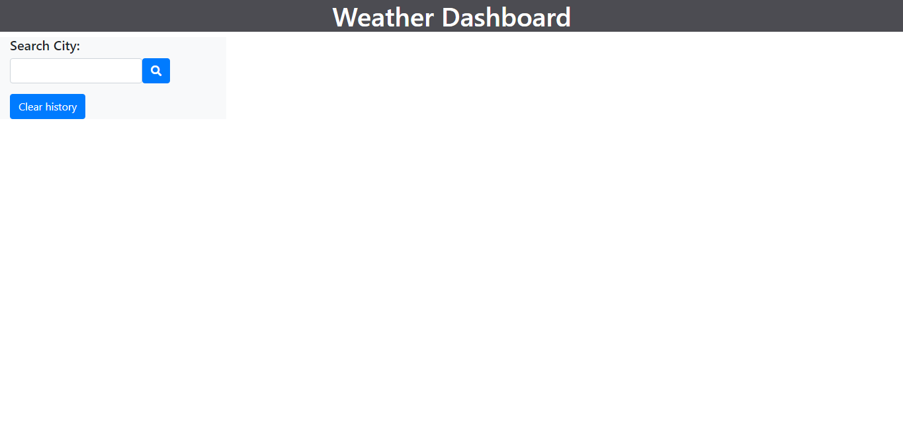

# Weather-Dashboard

This application allows users to search for any city and be presented with that city's current weather status and 5-day forecast. The application will also save the user's previously searched cities and allow them to be easily revisited in a sidebar.

## Installation

Run the application by going to https://acdecastro.github.io/Weather-Dashboard/.
The application's code can be found at https://github.com/ACDecastro/Weather-Dashboard.

## Usage

When the user first visits the application, they will be presented with the above screen. The user can then enter the name of any city in the search bar.

Every time the user searches for a city recognized by the Open Weather API, the application will display the current weather status of that city along with its 5-day forecast. The name of the city will also appear in history bar. The user can click on cities they have searched for to have the weeather for that city displayed again.